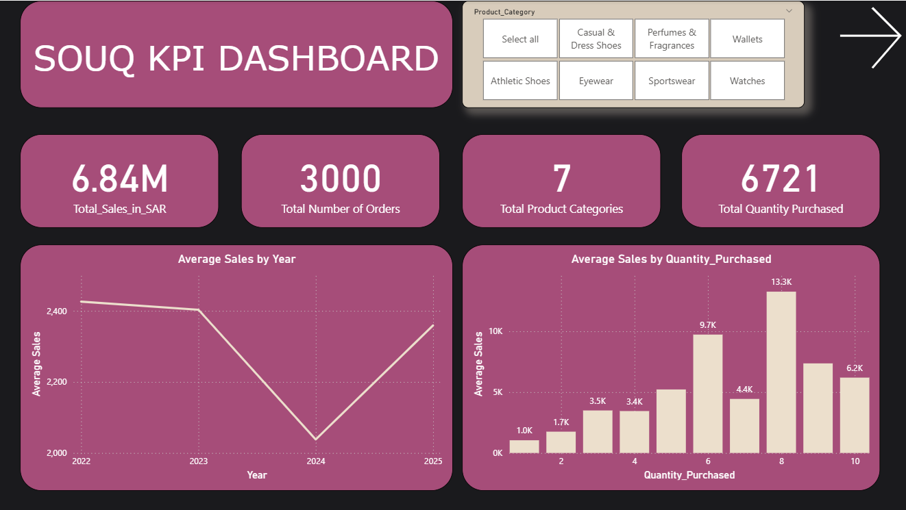
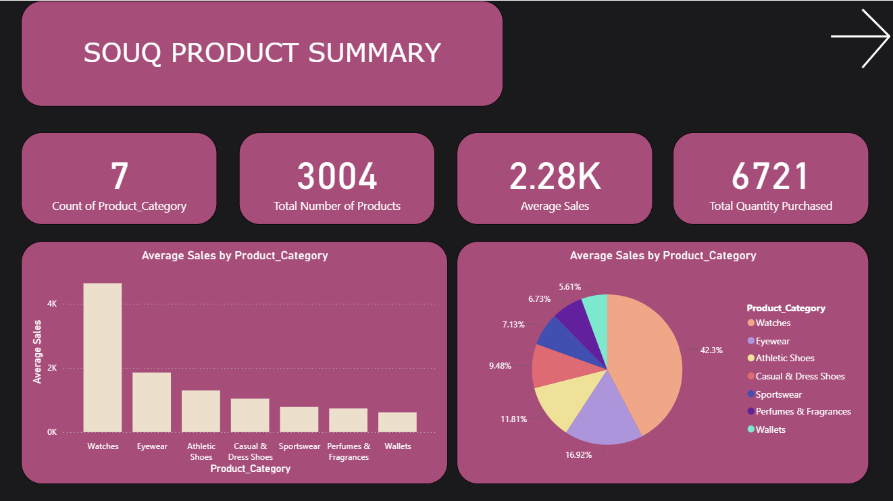

# Souq.com-Ecommerce
 
## Project Overview  
**Souq.com** (an Amazon company) is one of the largest e-commerce marketplaces in the Middle East, serving customers across the UAE, Saudi Arabia, Egypt and beyond.  
This project explores raw transactional data to uncover business insights:  
- What are the top-selling categories and products?  
- Overall Sales turnover.  
- Cumilative Yearly and Monthly Sales analysis. 
- How can we build dashboards for decision-making?

  ## Technologies & Tools Used  
- **Python**: Pandas, NumPy, Matplotlib, Seaborn for data processing & visualization  
- **SQL / PostgreSQL**: Data modelling and queries  
- **Power BI**: Interactive dashboard for business users  
- **GitHub**: Version control and repository hosting

## Key Analyses & Insights  
- **Sales Trend by Category**: Which product categories (Watches, Eyewear, Shoes, etc.) dominate?  
- **Customer Order Segmentation**: High-value-order vs Standard-value-orders  
- **Monthly Sales Behaviours**: Identify spikes in monthly behaviours  
- **Price vs Quantity Relationship**: Does a higher unit price reduce quantity sold?  

## Dashboard Visuals

